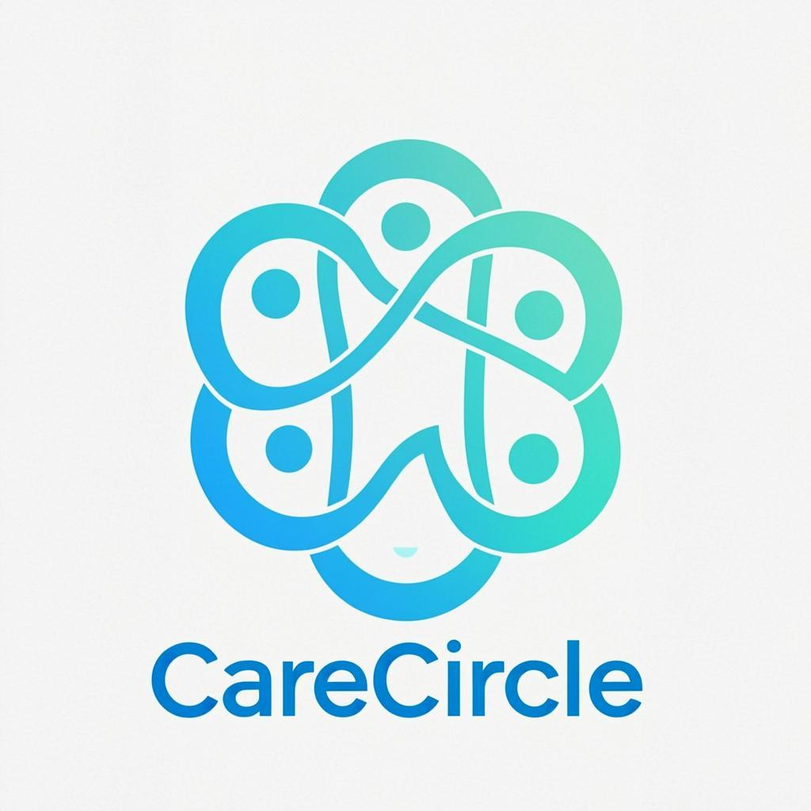

# CareCircle - Plateforme de Soutien Intelligent pour Aidants Familiaux

<p align="center">
  
</p>

<p align="center">
  <strong>Le compagnon digital des aidants familiaux</strong>
</p>

<p align="center">
  Assistant IA personnalisé • Coordination des soins • Communauté bienveillante • Ressources adaptées
</p>

---

## 🌟 À propos

CareCircle est une application web moderne conçue pour accompagner les **11 millions d'aidants familiaux** en France et les **350+ millions** dans le monde. Notre mission : faciliter le quotidien de ceux qui accompagnent un proche malade, âgé ou en situation de handicap.

## ✨ Fonctionnalités

### 🤖 Assistant IA Cleo
- Chat interactif disponible 24h/24
- Conseils personnalisés basés sur votre situation
- Détection des signes d'épuisement

### 📅 Coordination des Soins
- Calendrier médical partagé
- Suivi des médicaments avec rappels
- Journal des symptômes
- Historique médical exportable

### 👥 Communauté d'Entraide
- Groupes thématiques (Alzheimer, Cancer, Handicap...)
- Forum de discussion
- Système de mentorat entre aidants

### 📚 Ressources Éducatives
- Guides pratiques par pathologie
- Webinaires avec professionnels
- Formations certifiantes

### 🧘 Bien-être de l'Aidant
- Score de bien-être personnalisé
- Suivi du stress et du sommeil
- Activités suggérées
- Prévention du burnout

## 🚀 Démarrage Rapide

### Prérequis
- Node.js 18+ ou Bun
- npm, yarn ou bun

### Installation

```bash
# Cloner le repository
git clone https://github.com/votre-username/carecircle.git
cd carecircle

# Installer les dépendances
bun install

# Lancer en développement
bun run dev
```

L'application sera accessible sur [http://localhost:3000](http://localhost:3000)

## 🏗️ Stack Technique

- **Framework** : Next.js 16 (App Router)
- **Langage** : TypeScript 5
- **Styling** : Tailwind CSS 4 + shadcn/ui
- **Animations** : Framer Motion
- **Base de données** : Prisma + SQLite
- **État** : Zustand + localStorage

## 📁 Structure du Projet

```
carecircle/
├── src/
│   ├── app/
│   │   ├── page.tsx          # Application principale
│   │   ├── layout.tsx        # Layout racine
│   │   └── globals.css       # Styles globaux
│   ├── components/
│   │   └── ui/               # Composants shadcn/ui
│   ├── hooks/                # Hooks personnalisés
│   └── lib/                  # Utilitaires
├── prisma/
│   └── schema.prisma         # Schéma base de données
├── public/                   # Assets statiques
└── download/                 # Documents générés
```

## 🌐 Déploiement

### Vercel (Recommandé)

1. Créer un compte sur [vercel.com](https://vercel.com)
2. Connecter votre repository GitHub
3. Cliquer sur "Deploy"

[](https://vercel.com/new)

### Variables d'environnement

```env
DATABASE_URL="file:./db/carecircle.db"
```

## 🤝 Contribution

Les contributions sont les bienvenues ! N'hésitez pas à ouvrir une issue ou soumettre une pull request.

## 📄 Licence

Ce projet est sous licence MIT.

---

<p align="center">
  Fait avec ❤️ pour les aidants familiaux
</p>
